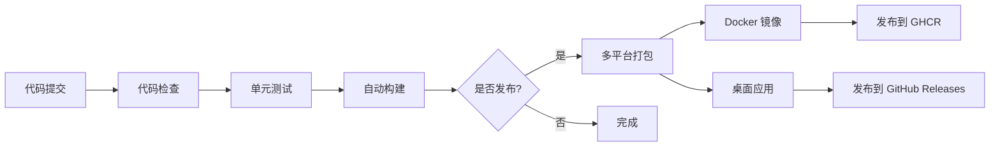

# CI/CD 流水线文档

## 概述

本项目使用 **GitHub Actions** 实现持续集成和持续部署（CI/CD），自动化代码检查、测试、构建和发布流程。

## 架构设计

### CI/CD 流程



### 工作流文件结构

```
.github/workflows/
├── env.yml              # 共享环境变量
├── frontend-ci.yml      # 前端 CI 工作流
├── backend-ci.yml       # 后端 CI 工作流
└── release.yml          # 发布工作流
```

---

## 工作流详细说明

### 1. 前端 CI (`frontend-ci.yml`)

**触发条件**：
- Push 到 `main` 或 `develop` 分支
- Pull Request 到 `main` 或 `develop` 分支
- 修改 `src/frontend/` 或 `src-tauri/` 目录下的文件

**执行步骤**：

```
┌─────────────┐
│ 代码检查     │ → ESLint + TypeScript 类型检查
└──────┬──────┘
       │
       ▼
┌─────────────┐
│ 单元测试     │ → Jest 测试 + 覆盖率报告
└──────┬──────┘
       │
       ▼
┌─────────────┐
│ 构建检查     │ → Vite 构建前端资源
└──────┬──────┘
       │
       ▼
┌─────────────┐
│ Tauri 构建   │ → 仅 PR 时执行，构建 Linux 版本
└─────────────┘
```

**关键配置**：
- **Node.js**: v18
- **Rust**: stable
- **缓存**: npm 依赖 + Cargo 依赖
- **覆盖率**: 使用 Codecov 上传

---

### 2. 后端 CI (`backend-ci.yml`)

**触发条件**：
- Push 到 `main` 或 `develop` 分支
- Pull Request 到 `main` 或 `develop` 分支
- 修改 `src/backend/` 或 `src/ai/` 目录下的文件

**执行步骤**：

```
┌─────────────┐
│ 代码检查     │ → ESLint + TypeScript 类型检查
└──────┬──────┘
       │
       ▼
┌─────────────┐
│ 单元测试     │ → Jest 测试 + PostgreSQL + Redis
└──────┬──────┘
       │
       ▼
┌─────────────┐
│ 构建        │ → TypeScript 编译
└──────┬──────┘
       │
       ▼
┌─────────────┐
│ 安全扫描     │ → npm audit + Snyk 扫描
└─────────────┘
```

**关键配置**：
- **Node.js**: v18
- **PostgreSQL**: v15（测试环境）
- **Redis**: v7（测试环境）
- **安全扫描**: npm audit + Snyk
- **覆盖率**: 使用 Codecov 上传

---

### 3. 发布工作流 (`release.yml`)

**触发条件**：
- 创建 GitHub Release
- 手动触发（workflow_dispatch）

**执行步骤**：

```
┌──────────────┐
│ 准备发布      │ → 确定版本号，创建 Release
└───────┬──────┘
        │
        ├──────────────────┬──────────────────┬──────────────────┐
        │                  │                  │                  │
        ▼                  ▼                  ▼                  ▼
┌──────────────┐  ┌──────────────┐  ┌──────────────┐  ┌──────────────┐
│ Windows 构建  │  │ macOS 构建   │  │ Linux 构建   │  │ Docker 构建  │
│  .msi, .exe  │  │  .dmg, .app  │  │  .deb, .App  │  │  Docker Image│
└───────┬──────┘  └───────┬──────┘  └───────┬──────┘  └───────┬──────┘
        │                  │                  │                  │
        └──────────────────┴──────────────────┴──────────────────┘
                                   │
                                   ▼
                          ┌──────────────┐
                          │ 发布通知      │
                          └──────────────┘
```

**构建产物**：
- **Windows**: `.msi` 安装包
- **macOS**: `.dmg` 安装包（Universal Binary）
- **Linux**: `.deb` 和 `.AppImage` 安装包
- **Docker**: 推送到 GitHub Container Registry (GHCR)

---

## 如何触发构建和部署

### 1. 触发 CI 构建

#### 自动触发（推荐）

```bash
# 1. 创建新分支
git checkout -b feature/new-feature

# 2. 修改代码并提交
git add .
git commit -m "feat: 添加新功能"

# 3. 推送到 GitHub
git push origin feature/new-feature

# 4. 创建 Pull Request
# GitHub Actions 会自动运行 CI 工作流
```

#### 手动触发

在 GitHub 仓库页面：
1. 点击 **Actions** 标签
2. 选择对应的工作流（Frontend CI 或 Backend CI）
3. 点击 **Run workflow** 按钮
4. 选择分支并运行

---

### 2. 触发发布流程

#### 方法 1：创建 GitHub Release（推荐）

```bash
# 1. 确保代码在 main 分支
git checkout main
git pull origin main

# 2. 创建并推送 tag
git tag v1.0.0
git push origin v1.0.0

# 3. 在 GitHub 创建 Release
# 访问：https://github.com/<username>/novel-writing-software/releases/new
# 选择 tag: v1.0.0
# 填写 Release 标题和描述
# 点击 "Publish release"

# 4. GitHub Actions 会自动构建并发布
```

#### 方法 2：手动触发 Release

```bash
# 1. 在 GitHub 仓库页面，点击 Actions 标签
# 2. 选择 "Release" 工作流
# 3. 点击 "Run workflow"
# 4. 输入版本号（如 v1.0.0）
# 5. 点击 "Run workflow" 绿色按钮
```

---

## 环境变量和 Secrets 配置

### 共享环境变量（`.github/workflows/env.yml`）

| 变量名 | 值 | 说明 |
|--------|-----|------|
| `NODE_VERSION` | `18` | Node.js 版本 |
| `RUST_VERSION` | `stable` | Rust 版本 |
| `PROJECT_NAME` | `novel-writing-software` | 项目名称 |
| `DOCKER_REGISTRY` | `ghcr.io` | Docker 镜像仓库 |
| `TEST_COVERAGE_THRESHOLD` | `80` | 测试覆盖率阈值 |

### GitHub Secrets 配置

在 GitHub 仓库设置中配置以下 Secrets：

**路径**：Settings → Secrets and variables → Actions → New repository secret

#### 必需的 Secrets

| Secret 名称 | 用途 | 获取方式 |
|------------|------|----------|
| `TAURI_PRIVATE_KEY` | Tauri 应用签名私钥 | `npm run tauri signer generate` 生成 |
| `TAURI_KEY_PASSWORD` | Tauri 私钥密码 | 生成时设置的密码 |
| `OPENAI_API_KEY` | OpenAI API Key | https://platform.openai.com/api-keys |
| `ANTHROPIC_API_KEY` | Anthropic API Key | https://console.anthropic.com/ |
| `STABILITY_API_KEY` | Stable Diffusion API Key | https://platform.stability.ai/ |
| `VOLCENGINE_API_KEY` | 火山引擎 API Key | https://console.volcengine.com/ |

#### 可选的 Secrets

| Secret 名称 | 用途 | 获取方式 |
|------------|------|----------|
| `SNYK_TOKEN` | Snyk 安全扫描 | https://snyk.io/ |
| `CODECOV_TOKEN` | Codecov 覆盖率上传 | https://codecov.io/ |

---

## 构建缓存优化

### 缓存策略

本项目使用多层缓存策略，大幅提升构建速度：

#### 1. Node.js 依赖缓存

```yaml
- name: Setup Node.js
  uses: actions/setup-node@v4
  with:
    cache: 'npm'
    cache-dependency-path: src/frontend/package-lock.json
```

**缓存位置**: `~/.npm`
**缓存键**: `package-lock.json` 的 hash
**预估提速**: 首次 2-3 分钟，后续 30-60 秒

#### 2. Rust 依赖缓存

```yaml
- name: Cache Rust dependencies
  uses: Swatinem/rust-cache@v2
  with:
    workspaces: src-tauri -> target
```

**缓存位置**: `src-tauri/target/`
**缓存键**: `Cargo.lock` 的 hash
**预估提速**: 首次 10-15 分钟，后续 2-3 分钟

#### 3. Docker 构建缓存

```yaml
- name: Build and push Docker image
  uses: docker/build-push-action@v5
  with:
    cache-from: type=gha
    cache-to: type=gha,mode=max
```

**缓存位置**: GitHub Actions Cache
**预估提速**: 首次 5-8 分钟，后续 1-2 分钟

---

## 监控和告警

### 构建状态监控

在 README.md 中添加构建状态徽章：

```markdown
[](https://github.com/<username>/novel-writing-software/actions)
[](https://github.com/<username>/novel-writing-software/actions)
[](https://github.com/<username>/novel-writing-software/actions)
```

### Codecov 覆盖率徽章

```markdown
[](https://codecov.io/gh/<username>/novel-writing-software)
```

---

## 故障排查

### 常见问题

#### 1. Tauri 构建失败

**症状**: `error: linking with cc failed`

**解决方案**: 确保安装了所有系统依赖
```yaml
- name: Install Tauri dependencies (Linux)
  run: |
    sudo apt-get update
    sudo apt-get install -y libgtk-3-dev libwebkit2gtk-4.0-dev libappindicator3-dev librsvg2-dev patchelf
```

#### 2. Rust 缓存失效

**症状**: 每次构建都重新编译 Rust 依赖

**解决方案**: 使用 `Swatinem/rust-cache@v2` 并确保 `Cargo.lock` 提交到仓库

#### 3. Docker 镜像推送失败

**症状**: `denied: permission_denied`

**解决方案**: 确保 GITHUB_TOKEN 有 `packages:write` 权限
```yaml
permissions:
  contents: read
  packages: write
```

#### 4. 测试环境连接失败

**症状**: PostgreSQL/Redis 连接超时

**解决方案**: 检查服务健康检查配置
```yaml
services:
  postgres:
    options: >-
      --health-cmd pg_isready
      --health-interval 10s
      --health-timeout 5s
      --health-retries 5
```

---

## 性能基准

### 构建时间（首次 vs 缓存命中）

| 工作流 | 首次构建 | 缓存命中 | 提速比例 |
|--------|----------|----------|----------|
| Frontend CI | ~8 分钟 | ~2 分钟 | 75% ↓ |
| Backend CI | ~6 分钟 | ~1.5 分钟 | 75% ↓ |
| Release (Windows) | ~15 分钟 | ~5 分钟 | 67% ↓ |
| Release (macOS) | ~20 分钟 | ~7 分钟 | 65% ↓ |
| Release (Linux) | ~12 分钟 | ~4 分钟 | 67% ↓ |
| Docker Build | ~8 分钟 | ~2 分钟 | 75% ↓ |

---

## 最佳实践

### 1. 分支策略

```
main         → 生产分支，只能通过 PR 合并
  ↑
develop      → 开发分支，日常开发
  ↑
feature/*    → 功能分支，开发新功能
hotfix/*     → 热修复分支，修复线上问题
```

### 2. Commit 规范

使用 Conventional Commits 规范：

```bash
feat: 添加新功能
fix: 修复 bug
docs: 更新文档
style: 代码格式调整
refactor: 重构代码
test: 添加测试
chore: 构建/工具链调整
```

### 3. PR 检查清单

在创建 PR 前，确保：

- [ ] 代码通过 ESLint 检查
- [ ] TypeScript 类型检查通过
- [ ] 所有测试通过
- [ ] 测试覆盖率 ≥ 80%
- [ ] 没有安全漏洞
- [ ] 更新了相关文档

### 4. 发布检查清单

在创建 Release 前，确保：

- [ ] 所有 CI 检查通过
- [ ] 更新了 CHANGELOG.md
- [ ] 版本号符合语义化版本规范
- [ ] 测试环境验证通过
- [ ] 备份了生产数据库
- [ ] 准备好回滚方案

---

## 相关文档

- [部署架构文档](./deployment-architecture.md)
- [监控配置文档](../monitoring/monitoring-setup.md)
- [运维手册](../operations/operations-manual.md)

---

**文档版本**: v1.0.0  
**最后更新**: 2026-05-07  
**维护者**: DevOps Team
