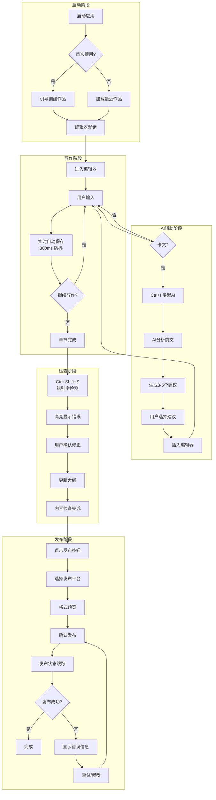
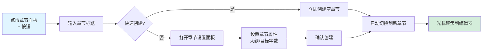
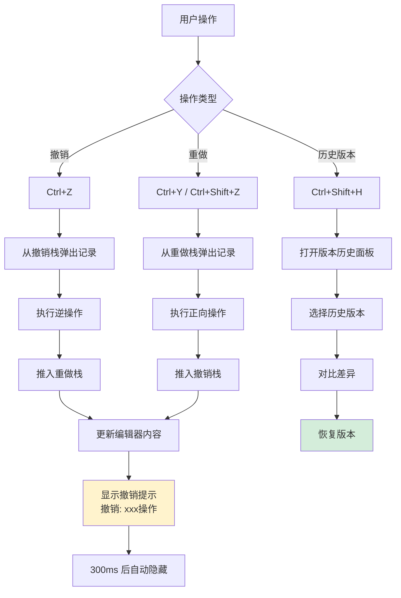
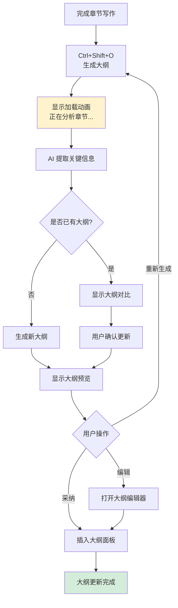
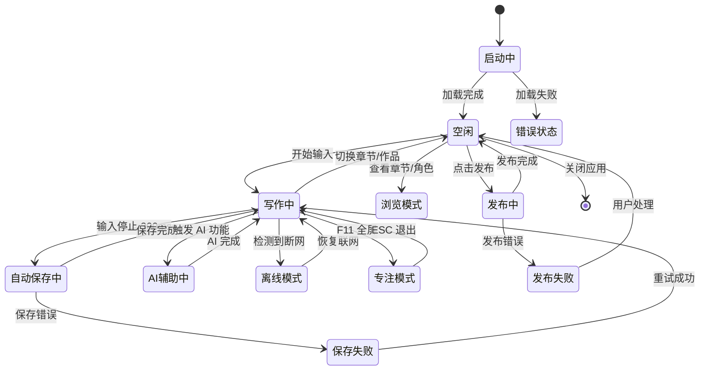
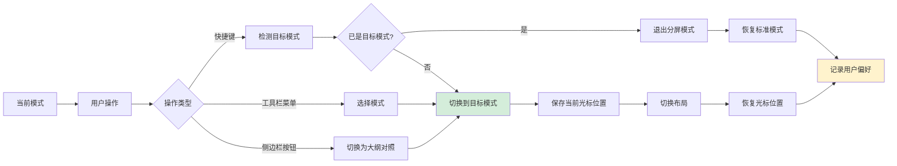
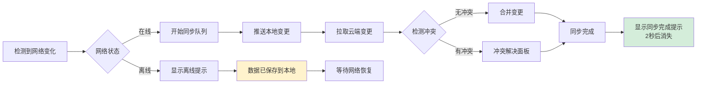

# 网文作者码字软件交互设计规范

**版本**: v1.0  
**日期**: 2026-05-06  
**设计师**: ArchitectUX  
**基于文档**: user-journey.md、system-design.md、PRD.md

---

## 1. 核心交互流程

### 1.1 写作主流程



### 1.2 核心操作流程

#### 1.2.1 创建章节流程



#### 1.2.2 撤销/重做流程



#### 1.2.3 AI 大纲生成流程



### 1.3 用户状态转换



---

## 2. 分屏写作模式设计

### 2.1 布局方案

#### 2.1.1 默认三栏布局

```
┌─────────────────────────────────────────────────────────────────┐
│  工具栏（可隐藏）                                                   │
│  [⬇ 已保存] [字数: 3,247] [今日: 1,832/4000]    [主题] [⚙ 设置]    │
├────────────┬──────────────────────────────────┬──────────────────┤
│            │                                  │                  │
│  左侧边栏   │         主编辑器                  │   AI 助手面板     │
│  (可折叠)   │       (60-70%)                   │    (可折叠)      │
│            │                                  │                  │
│  ┌────────┐│  ┌────────────────────────────┐  │  ┌────────────┐  │
│  │作品列表 ││  │                            │  │  │ AI 对话框   │  │
│  │章节树   ││  │   沉浸式写作区域            │  │  │ [思路启发]  │  │
│  │大纲对照 ││  │                            │  │  │ [错别字]    │  │
│  │角色卡片 ││  │   第三十八章：决战之巅       │  │  │ [续写]      │  │
│  │发布管理 ││  │                            │  │  │            │  │
│  └────────┘│  │   李明握紧手中的剑，眼神...  │  │  └────────────┘  │
│            │  │                            │  │                  │
│  宽度:     │  │                            │  │  宽度:           │
│  240-320px │  └────────────────────────────┘  │  280-360px       │
│            │                                  │                  │
├────────────┴──────────────────────────────────┴──────────────────┤
│  状态栏                                                            │
│  [《剑道独尊》] [第三十八章] [行 12, 列 45] [⬤ 在线] [☁ 同步完成]   │
└─────────────────────────────────────────────────────────────────┘
```

#### 2.1.2 分屏对照模式

```
┌─────────────────────────────────────────────────────────────────┐
│  工具栏                                                            │
│  [⬇ 已保存] [字数: 3,247]    [📊 分屏模式 ▼] [主题] [⚙ 设置]       │
├───────────────────────────────┬─────────────────────────────────┤
│                               │                                 │
│  左侧面板（对照区）             │      右侧编辑器（写作区）          │
│  宽度: 40-50%                  │      宽度: 50-60%               │
│                               │                                 │
│  ┌───────────────────────────┐│  ┌─────────────────────────────┐│
│  │ [大纲] [前文] [角色] [笔记]││  │                             ││
│  ├───────────────────────────┤│  │   第三十八章：决战之巅       ││
│  │ 📋 第三十八章大纲          ││  │                             ││
│  │                           ││  │   李明握紧手中的剑，         ││
│  │ 1. 李明与敌首对峙          ││  │   眼神坚定...               ││
│  │ 2. 回忆师门往事            ││  │                             ││
│  │ 3. 施展绝技"剑气纵横"      ││  │   【支持同步滚动】           ││
│  │ 4. 击败敌人，境界突破      ││  │                             ││
│  │                           ││  │   【支持大纲跳转】           ││
│  │ 📍 当前位置: 第2节         ││  │                             ││
│  └───────────────────────────┘│  └─────────────────────────────┘│
│                               │                                 │
├───────────────────────────────┴─────────────────────────────────┤
│  状态栏                                                            │
│  [《剑道独尊》] [第三十八章] [分屏模式: 大纲对照] [⬤ 在线]          │
└─────────────────────────────────────────────────────────────────┘
```

### 2.2 分屏模式切换逻辑

#### 2.2.1 模式类型

| 模式 | 说明 | 默认布局 | 快捷键 |
|------|------|----------|--------|
| **标准模式** | 单栏编辑器，侧边栏折叠 | 编辑器 100% | Ctrl+Shift+1 |
| **大纲对照** | 左侧大纲，右侧编辑器 | 左 40% : 右 60% | Ctrl+Shift+2 |
| **前文对照** | 左侧前一章，右侧当前章 | 左 50% : 右 50% | Ctrl+Shift+3 |
| **角色对照** | 左侧角色卡片，右侧编辑器 | 左 30% : 右 70% | Ctrl+Shift+4 |
| **双章对照** | 左侧大纲+前文，右侧编辑器 | 左 35% : 右 65% | Ctrl+Shift+5 |

#### 2.2.2 切换流程



#### 2.2.3 分屏拖拽调整

```
拖拽逻辑:
┌─────────────────────────────────────────┐
│  左侧面板  │  │  右侧编辑器               │
│           │  │                           │
│           │  │                           │
│           │  │                           │
│           ▼  │                           │
│      [分隔线] │                           │
│      可拖拽   │                           │
│           │  │                           │
└─────────────────────────────────────────┘

规则:
- 最小宽度: 左侧 280px，右侧 400px
- 拖拽响应: 实时预览，无延迟
- 记忆位置: 自动保存用户调整的比例
- 双击重置: 双击分隔线恢复默认比例
```

### 2.3 同步滚动机制

```javascript
// 同步滚动逻辑
class SyncScrollManager {
  constructor() {
    this.leftPanel = null;
    this.rightPanel = null;
    this.enabled = false;
    this.ratio = 1; // 左右滚动比例
  }
  
  // 计算滚动比例（基于内容长度）
  calculateRatio() {
    const leftHeight = this.leftPanel.scrollHeight;
    const rightHeight = this.rightPanel.scrollHeight;
    this.ratio = leftHeight / rightHeight;
  }
  
  // 左侧滚动 → 右侧跟随
  onLeftScroll() {
    if (!this.enabled) return;
    const scrollTop = this.leftPanel.scrollTop;
    this.rightPanel.scrollTop = scrollTop / this.ratio;
  }
  
  // 右侧滚动 → 左侧跟随
  onRightScroll() {
    if (!this.enabled) return;
    const scrollTop = this.rightPanel.scrollTop;
    this.leftPanel.scrollTop = scrollTop * this.ratio;
  }
  
  // 切换同步滚动
  toggle() {
    this.enabled = !this.enabled;
    this.calculateRatio();
  }
}
```

---

## 3. 快捷键系统设计

### 3.1 快捷键分类

#### 3.1.1 编辑类快捷键

| 快捷键 | 功能 | 说明 | 优先级 |
|--------|------|------|--------|
| **Ctrl+S** | 保存 | 手动触发保存（自动保存时显示提示） | P0 |
| **Ctrl+Z** | 撤销 | 撤销上一步操作 | P0 |
| **Ctrl+Y** | 重做 | 重做已撤销操作 | P0 |
| **Ctrl+Shift+Z** | 重做 | 重做已撤销操作（备选） | P0 |
| **Ctrl+C** | 复制 | 复制选中文本 | P0 |
| **Ctrl+X** | 剪切 | 剪切选中文本 | P0 |
| **Ctrl+V** | 粘贴 | 粘贴文本 | P0 |
| **Ctrl+A** | 全选 | 全选当前章节内容 | P0 |
| **Ctrl+F** | 查找 | 打开查找对话框 | P1 |
| **Ctrl+H** | 查找替换 | 打开查找替换对话框 | P1 |
| **Ctrl+D** | 复制行 | 复制当前行到下一行 | P2 |
| **Ctrl+K** | 删除行 | 删除当前行 | P2 |
| **Tab** | 缩进 | 增加缩进 | P0 |
| **Shift+Tab** | 反向缩进 | 减少缩进 | P1 |

#### 3.1.2 导航类快捷键

| 快捷键 | 功能 | 说明 | 优先级 |
|--------|------|------|--------|
| **Ctrl+Home** | 跳转到章节开头 | 光标移动到章节开头 | P0 |
| **Ctrl+End** | 跳转到章节结尾 | 光标移动到章节结尾 | P0 |
| **Ctrl+↑** | 上一章节 | 切换到上一章节 | P1 |
| **Ctrl+↓** | 下一章节 | 切换到下一章节 | P1 |
| **Ctrl+G** | 跳转到指定行 | 打开行号跳转对话框 | P2 |
| **Ctrl+Shift+H** | 版本历史 | 打开版本历史面板 | P1 |
| **F11** | 专注模式 | 全屏写作，隐藏所有面板 | P0 |
| **Esc** | 退出专注模式 | 退出全屏，恢复界面 | P0 |
| **Ctrl+B** | 切换侧边栏 | 显示/隐藏左侧边栏 | P1 |
| **Ctrl+Shift+B** | 切换 AI 面板 | 显示/隐藏 AI 助手面板 | P1 |

#### 3.1.3 AI 功能快捷键

| 快捷键 | 功能 | 说明 | 优先级 |
|--------|------|------|--------|
| **Ctrl+I** | 打开 AI 助手 | 唤起 AI 助手面板 | P1 |
| **Ctrl+Shift+S** | 错别字检测 | 触发当前章节错别字检测 | P1 |
| **Ctrl+Shift+O** | 生成大纲 | 触发当前章节大纲生成 | P1 |
| **Ctrl+Shift+G** | 续写功能 | 触发 AI 续写当前段落 | P1 |
| **Ctrl+Shift+A** | 思路启发 | 触发 AI 思路启发功能 | P1 |
| **Ctrl+Shift+C** | 一致性检查 | 触发全文一致性检查 | P2 |
| **Ctrl+Enter** | 确认 AI 建议 | 在 AI 面板中确认采纳建议 | P1 |
| **Esc** | 取消 AI 操作 | 取消当前 AI 生成任务 | P1 |

#### 3.1.4 平台发布快捷键

| 快捷键 | 功能 | 说明 | 优先级 |
|--------|------|------|--------|
| **Ctrl+P** | 快速发布 | 打开发布对话框 | P1 |
| **Ctrl+Shift+P** | 发布到上次平台 | 一键发布到上次选择的平台 | P2 |
| **F5** | 刷新同步 | 手动触发云端同步 | P1 |

#### 3.1.5 分屏模式快捷键

| 快捷键 | 功能 | 说明 | 优先级 |
|--------|------|------|--------|
| **Ctrl+Shift+1** | 标准模式 | 单栏编辑器 | P1 |
| **Ctrl+Shift+2** | 大纲对照 | 左侧大纲，右侧编辑器 | P1 |
| **Ctrl+Shift+3** | 前文对照 | 左侧前一章，右侧当前章 | P2 |
| **Ctrl+Shift+4** | 角色对照 | 左侧角色卡片，右侧编辑器 | P2 |
| **Ctrl+Shift+5** | 双章对照 | 左侧大纲+前文，右侧编辑器 | P2 |

### 3.2 快捷键冲突检测

```javascript
// 快捷键冲突检测逻辑
class ShortcutManager {
  constructor() {
    this.shortcuts = new Map();
    this.conflicts = [];
  }
  
  // 注册快捷键
  register(key, handler, options = {}) {
    const { priority = 0, context = 'global' } = options;
    
    // 检测冲突
    if (this.shortcuts.has(key)) {
      const existing = this.shortcuts.get(key);
      if (existing.priority <= priority) {
        this.conflicts.push({
          key,
          existing: existing.handler.name,
          new: handler.name,
          resolved: '新快捷键覆盖'
        });
        this.shortcuts.set(key, { handler, priority, context });
      } else {
        this.conflicts.push({
          key,
          existing: existing.handler.name,
          new: handler.name,
          resolved: '保留原快捷键'
        });
      }
    } else {
      this.shortcuts.set(key, { handler, priority, context });
    }
  }
  
  // 触发快捷键
  trigger(event) {
    const key = this.normalizeKey(event);
    if (this.shortcuts.has(key)) {
      const { handler, context } = this.shortcuts.get(key);
      if (this.isContextActive(context)) {
        event.preventDefault();
        handler();
        return true;
      }
    }
    return false;
  }
  
  // 规范化按键组合
  normalizeKey(event) {
    const parts = [];
    if (event.ctrlKey) parts.push('Ctrl');
    if (event.shiftKey) parts.push('Shift');
    if (event.altKey) parts.push('Alt');
    if (event.metaKey) parts.push('Meta');
    parts.push(event.key);
    return parts.join('+');
  }
}
```

### 3.3 快捷键自定义

```
用户可自定义快捷键（设置 → 快捷键设置）:

┌─────────────────────────────────────────────────────────────┐
│  快捷键设置                                                   │
├─────────────────────────────────────────────────────────────┤
│  功能                    当前快捷键       [修改]  [重置]      │
│  ──────────────────────────────────────────────────────────│
│  保存                    Ctrl+S           [修改]  [重置]      │
│  撤销                    Ctrl+Z           [修改]  [重置]      │
│  错别字检测              Ctrl+Shift+S     [修改]  [重置]      │
│  AI 助手                 Ctrl+I           [修改]  [重置]      │
│  ...                                                        │
├─────────────────────────────────────────────────────────────┤
│  [导出配置] [导入配置] [恢复默认]                             │
└─────────────────────────────────────────────────────────────┘

规则:
- 避免与系统快捷键冲突（如 Ctrl+C/V/X）
- 避免与输入法快捷键冲突
- 支持导出/导入配置文件
- 支持恢复默认设置
```

---

## 4. 状态反馈机制设计

### 4.1 保存状态反馈

#### 4.1.1 状态类型

| 状态 | 图标 | 文本 | 颜色 | 持续时间 |
|------|------|------|------|----------|
| **已保存** | ✓ | 已保存 | 绿色 | 常驻 |
| **保存中** | ◐ | 保存中... | 蓝色 | 保存期间 |
| **保存失败** | ✗ | 保存失败 | 红色 | 5秒或用户关闭 |
| **离线保存** | ⚠ | 已保存到本地（离线） | 橙色 | 常驻 |
| **同步中** | ↻ | 同步中... | 蓝色 | 同步期间 |
| **同步完成** | ✓ | 同步完成 | 绿色 | 2秒后消失 |
| **同步失败** | ✗ | 同步失败 | 红色 | 5秒或用户关闭 |

#### 4.1.2 状态显示位置

```
位置 1: 工具栏右上角（主要）
┌─────────────────────────────────────────────┐
│  [⬇ 已保存] [字数: 3,247]    [主题] [⚙]     │
└─────────────────────────────────────────────┘

位置 2: 状态栏左侧（辅助）
┌─────────────────────────────────────────────┐
│  [《剑道独尊》] [⬇ 已保存] [⬤ 在线]         │
└─────────────────────────────────────────────┘

位置 3: 浮动提示（严重错误）
┌─────────────────────────────────────────────┐
│  ⚠ 保存失败！请检查磁盘空间或权限设置        │
│  [重试] [查看详情] [× 关闭]                 │
└─────────────────────────────────────────────┘
```

### 4.2 网络/同步状态反馈

#### 4.2.1 网络状态

| 状态 | 图标 | 文本 | 位置 | 交互 |
|------|------|------|------|------|
| **在线** | ⬤ | 在线 | 状态栏 | 无 |
| **离线** | ◯ | 离线模式 | 状态栏 + 工具栏提示 | 点击查看详情 |
| **网络不稳定** | ⚠ | 网络不稳定 | 状态栏 | 点击查看详情 |

#### 4.2.2 同步状态



### 4.3 字数统计反馈

#### 4.3.1 显示内容

```
工具栏显示:
┌─────────────────────────────────────────────┐
│  总字数: 247,832 | 本章: 3,247 | 今日: 1,832 │
└─────────────────────────────────────────────┘

悬停显示详细信息:
┌─────────────────────────────────────────────┐
│  📊 字数统计                                 │
│  ─────────────────────────────────────────  │
│  当前作品总字数: 247,832                     │
│  当前章节字数: 3,247                         │
│  今日写作字数: 1,832                         │
│  今日目标: 4,000 (完成 46%)                  │
│  ─────────────────────────────────────────  │
│  本周写作: 12,547 字                         │
│  本月写作: 89,234 字                         │
│  累计写作天数: 127 天                        │
└─────────────────────────────────────────────┘
```

#### 4.3.2 今日目标进度

```
进度条显示:
┌─────────────────────────────────────────────┐
│  今日目标: 1,832 / 4,000                    │
│  [████████░░░░░░░░░░░░░░░░░░░░] 46%        │
└─────────────────────────────────────────────┘

完成目标时:
┌─────────────────────────────────────────────┐
│  🎉 恭喜！今日目标已完成！                    │
│  今日写作: 4,012 字                          │
│  [查看统计] [分享成就]                       │
└─────────────────────────────────────────────┘
```

### 4.4 操作反馈

#### 4.4.1 撤销/重做反馈

```
撤销操作:
┌─────────────────────────────────────────────┐
│  ↩ 撤销: 删除 45 字                          │
└─────────────────────────────────────────────┘
(显示 1.5 秒后自动消失)

重做操作:
┌─────────────────────────────────────────────┐
│  ↪ 重做: 删除 45 字                          │
└─────────────────────────────────────────────┘
(显示 1.5 秒后自动消失)

撤销栈已满:
┌─────────────────────────────────────────────┐
│  ⚠ 撤销栈已满，最早的 10 步操作将被清除       │
│  [查看版本历史] [× 关闭]                     │
└─────────────────────────────────────────────┘
```

#### 4.4.2 章节切换反馈

```
切换章节:
┌─────────────────────────────────────────────┐
│  正在加载章节: 第三十九章...                  │
│  [████████████░░░░░░░░] 60%                 │
└─────────────────────────────────────────────┘
(加载完成自动消失)

切换成功:
┌─────────────────────────────────────────────┐
│  ✓ 已切换到: 第三十九章                       │
│  字数: 2,847 | 上次编辑: 2 小时前            │
└─────────────────────────────────────────────┘
(显示 1 秒后自动消失)
```

---

## 5. 异常处理交互设计

### 5.1 网络异常

#### 5.1.1 断网场景

```
检测到断网:
┌─────────────────────────────────────────────┐
│  ⚠ 网络连接已断开                             │
│  ─────────────────────────────────────────  │
│  您的工作已自动保存到本地，不会丢失。          │
│                                             │
│  当前状态:                                   │
│  ✓ 本地保存正常                              │
│  ⏳ 待同步: 3 个章节                          │
│                                             │
│  [查看离线帮助] [× 关闭]                     │
└─────────────────────────────────────────────┘

状态栏显示:
[《剑道独尊》] [第三十八章] [◯ 离线] [待同步: 3]
```

#### 5.1.2 网络恢复

```
检测到网络恢复:
┌─────────────────────────────────────────────┐
│  ✓ 网络已恢复                                │
│  ─────────────────────────────────────────  │
│  正在同步 3 个章节到云端...                   │
│  [████████████████░░░░] 80%                 │
└─────────────────────────────────────────────┘

同步完成:
┌─────────────────────────────────────────────┐
│  ✓ 同步完成                                  │
│  已成功同步 3 个章节到云端                    │
└─────────────────────────────────────────────┘
(显示 2 秒后自动消失)
```

### 5.2 保存失败

#### 5.2.1 本地保存失败

```
本地保存失败（磁盘空间不足）:
┌─────────────────────────────────────────────┐
│  ✗ 保存失败                                  │
│  ─────────────────────────────────────────  │
│  原因: 磁盘空间不足                           │
│                                             │
│  当前磁盘剩余空间: 128 MB                     │
│  建议释放至少 1 GB 空间                       │
│                                             │
│  ⚠ 您的数据目前暂存在内存中，请尽快处理        │
│                                             │
│  [清理磁盘空间] [导出到其他位置] [查看帮助]   │
└─────────────────────────────────────────────┘

状态栏显示:
[⚠ 保存失败] [磁盘空间不足] [点击查看详情]
```

#### 5.2.2 云端同步失败

```
云端同步失败:
┌─────────────────────────────────────────────┐
│  ✗ 云端同步失败                               │
│  ─────────────────────────────────────────  │
│  原因: 服务器响应超时                          │
│                                             │
│  本地数据已安全保存，不受影响。                │
│  待同步内容将在网络恢复后自动重试。            │
│                                             │
│  [手动重试] [查看同步队列] [× 关闭]           │
└─────────────────────────────────────────────┘
```

### 5.3 AI 功能异常

#### 5.3.1 AI 服务不可用

```
AI 服务不可用:
┌─────────────────────────────────────────────┐
│  ⚠ AI 服务暂时不可用                          │
│  ─────────────────────────────────────────  │
│  原因: API 服务维护中                         │
│                                             │
│  预计恢复时间: 2026-05-06 18:00              │
│                                             │
│  其他功能不受影响，您可以继续写作。            │
│                                             │
│  [稍后重试] [查看系统状态] [× 关闭]           │
└─────────────────────────────────────────────┘
```

#### 5.3.2 AI 生成失败

```
AI 生成失败:
┌─────────────────────────────────────────────┐
│  ✗ AI 生成失败                                │
│  ─────────────────────────────────────────  │
│  原因: 生成内容不符合要求                      │
│                                             │
│  建议:                                        │
│  1. 调整输入的提示词                          │
│  2. 提供更多上下文信息                        │
│  3. 尝试不同的生成参数                        │
│                                             │
│  [重新生成] [调整参数] [查看帮助] [× 关闭]    │
└─────────────────────────────────────────────┘
```

### 5.4 发布异常

#### 5.4.1 发布失败

```
发布失败:
┌─────────────────────────────────────────────┐
│  ✗ 发布失败                                  │
│  ─────────────────────────────────────────  │
│  平台: 某点                                   │
│  原因: 登录凭证已过期                          │
│                                             │
│  解决方案:                                    │
│  请重新登录某点平台后再试                      │
│                                             │
│  [重新登录] [查看详细错误] [× 关闭]           │
└─────────────────────────────────────────────┘

多平台发布部分失败:
┌─────────────────────────────────────────────┐
│  ⚠ 发布部分成功                               │
│  ─────────────────────────────────────────  │
│  成功: 某茄、晋江                              │
│  失败: 某点（登录凭证过期）                    │
│                                             │
│  [重试失败的平台] [查看发布历史] [× 关闭]     │
└─────────────────────────────────────────────┘
```

#### 5.4.2 格式转换失败

```
格式转换失败:
┌─────────────────────────────────────────────┐
│  ✗ 格式转换失败                               │
│  ─────────────────────────────────────────  │
│  平台: 晋江                                   │
│  原因: 章节字数超过平台限制（晋江单章 ≤ 5万字）│
│                                             │
│  当前章节字数: 52,847 字                      │
│  平台限制: 50,000 字                          │
│                                             │
│  [拆分章节] [手动编辑] [取消发布]             │
└─────────────────────────────────────────────┘
```

### 5.5 数据冲突处理

#### 5.5.1 多设备冲突

```
检测到冲突:
┌─────────────────────────────────────────────┐
│  ⚠ 检测到内容冲突                             │
│  ─────────────────────────────────────────  │
│  章节: 第三十八章                             │
│  冲突原因: 在另一台设备上修改了相同内容        │
│                                             │
│  本地版本:                                    │
│  最后修改: 今天 14:23                         │
│  字数: 3,247                                 │
│                                             │
│  云端版本:                                    │
│  最后修改: 今天 14:30                         │
│  字数: 3,512                                 │
│                                             │
│  [查看差异对比] [保留本地] [使用云端]          │
│  [手动合并]                                   │
└─────────────────────────────────────────────┘
```

#### 5.5.2 差异对比视图

```
差异对比:
┌───────────────────────┬───────────────────────┐
│  本地版本              │  云端版本              │
│  今天 14:23            │  今天 14:30            │
├───────────────────────┼───────────────────────┤
│  李明握紧手中的剑，    │  李明握紧手中的剑，    │
│  眼神坚定地看着对面    │  眼神坚定地看着对面    │
│  的敌人。             │  的敌人。             │
│                       │                       │
│  【删除】              │  【新增】              │
│  他深吸一口气，        │  他深吸一口气，        │
│  准备施展绝技。        │  准备施展绝技。        │
│                       │  这一刻，他想起了师父  │
│                       │  曾经说过的话。        │
│                       │                       │
│  剑气纵横！           │  剑气纵横！           │
└───────────────────────┴───────────────────────┘
[← 上一个差异] [下一个差异 →] [合并选中内容] [取消]
```

### 5.6 系统异常

#### 5.6.1 内存不足

```
内存不足警告:
┌─────────────────────────────────────────────┐
│  ⚠ 内存使用过高                               │
│  ─────────────────────────────────────────  │
│  当前内存占用: 1.8 GB / 2.0 GB                │
│                                             │
│  建议操作:                                    │
│  1. 保存当前工作并重启应用                    │
│  2. 减少同时打开的章节数量                    │
│  3. 关闭不需要的面板                          │
│                                             │
│  [立即保存并重启] [稍后处理] [查看详情]       │
└─────────────────────────────────────────────┘
```

#### 5.6.2 应用崩溃恢复

```
应用异常退出后重新启动:
┌─────────────────────────────────────────────┐
│  🔄 正在恢复上次的工作状态                     │
│  ─────────────────────────────────────────  │
│  检测到上次应用未正常关闭                      │
│                                             │
│  正在恢复:                                    │
│  ✓ 当前作品: 《剑道独尊》                     │
│  ✓ 当前章节: 第三十八章                       │
│  ✓ 光标位置: 第 12 行                        │
│  ✓ 未保存内容: 3,247 字                      │
│                                             │
│  [恢复工作] [从上次保存点开始] [查看详情]     │
└─────────────────────────────────────────────┘
```

---

## 6. 交互设计规范

### 6.1 响应时间标准

| 操作类型 | 响应时间 | 反馈方式 |
|----------|----------|----------|
| **即时操作** | ≤ 50ms | 无需反馈（如输入、滚动） |
| **快速操作** | ≤ 200ms | 无需反馈（如撤销、切换章节） |
| **中等操作** | ≤ 1s | 显示加载状态 |
| **慢速操作** | ≤ 3s | 显示进度条 + 预计时间 |
| **长时间操作** | ≤ 30s | 显示进度条 + 可取消按钮 |

### 6.2 加载状态设计

```
小型加载（≤ 1s）:
┌─────────────────────────────────────────────┐
│  正在加载...                                 │
│  [◐░░░░░░░░░░░░░░░░]                        │
└─────────────────────────────────────────────┘

中型加载（1-3s）:
┌─────────────────────────────────────────────┐
│  正在加载章节: 第三十九章                     │
│  [████████░░░░░░░░░░░░░░] 40%               │
└─────────────────────────────────────────────┘

大型加载（≥ 3s）:
┌─────────────────────────────────────────────┐
│  正在分析全文...                             │
│  [████████████████░░░░] 80%                 │
│  预计剩余时间: 5 秒                           │
│  [取消]                                      │
└─────────────────────────────────────────────┘
```

### 6.3 用户确认对话框规范

```
危险操作（删除章节）:
┌─────────────────────────────────────────────┐
│  ⚠ 确认删除章节？                             │
│  ─────────────────────────────────────────  │
│  即将删除: 第三十八章                         │
│  字数: 3,247 字                              │
│                                             │
│  ⚠ 此操作不可撤销，请确认                    │
│                                             │
│  [取消] [确认删除]（红色按钮）                │
└─────────────────────────────────────────────┘

普通操作（切换章节未保存）:
┌─────────────────────────────────────────────┐
│  当前章节有未保存的修改                        │
│  ─────────────────────────────────────────  │
│  是否保存后再切换？                           │
│                                             │
│  [不保存] [保存并切换] [取消]                 │
└─────────────────────────────────────────────┘
```

### 6.4 错误提示文案规范

```
错误提示应包含:
1. ❌ 错误类型（简短）
2. 📋 错误原因（清晰）
3. 💡 解决方案（具体）

示例:
┌─────────────────────────────────────────────┐
│  ✗ 文件打开失败                               │
│  ─────────────────────────────────────────  │
│  原因: 文件已被其他程序占用                    │
│                                             │
│  解决方案:                                    │
│  请关闭其他编辑器后重试                        │
│  或使用"文件 → 另存为"保存到新位置            │
│                                             │
│  [重试] [另存为] [查看帮助] [× 关闭]          │
└─────────────────────────────────────────────┘
```

---

## 7. 实现优先级

### 7.1 P0 必须实现

- [x] 核心写作流程（启动 → 写作 → 保存 → 发布）
- [x] 基础快捷键（Ctrl+S/Z/Y/C/V/X）
- [x] 保存状态反馈
- [x] 网络状态反馈
- [x] 基础异常处理（断网、保存失败）

### 7.2 P1 重要实现

- [ ] 分屏写作模式（大纲对照、前文对照）
- [ ] AI 功能快捷键
- [ ] 字数统计反馈（今日目标进度）
- [ ] 撤销/重做反馈
- [ ] 发布异常处理
- [ ] 数据冲突处理

### 7.3 P2 可选实现

- [ ] 高级分屏模式（双章对照、角色对照）
- [ ] 快捷键自定义
- [ ] 同步滚动
- [ ] 系统异常处理（内存不足、崩溃恢复）

---

## 8. 设计决策记录

### 8.1 为什么采用 300ms 防抖保存？

**理由**:
1. 避免频繁写入，降低 IO 压力
2. 用户无感知，300ms 内的输入不会丢失
3. 技术可行，SQLite 支持高频写入

**备选方案**:
- 无防抖：性能问题
- 1 秒防抖：延迟过长，用户可能感知
- 手动保存：违反"自动保存"原则

### 8.2 为什么默认三栏布局？

**理由**:
1. 主编辑器最大化，写作是核心任务
2. 侧边栏可折叠，不干扰写作
3. AI 助手独立，需要时易于访问
4. 状态栏常驻，数据安全可见

**备选方案**:
- 单栏布局：过于简单，不支持大纲对照
- 双栏布局：AI 助手占据过多空间

### 8.3 为什么 AI 功能默认折叠？

**理由**:
1. 专注写作，AI 是辅助功能
2. 降低认知负担，不需要时不显示
3. 快捷键快速访问，不影响效率
4. 渐进增强，新手不会困惑

---

## 9. 下一步

1. ✅ 交互设计完成
2. ⏳ UI 原型设计（ui-prototype.md）
3. ⏳ 组件设计规范（component-design.md）
4. ⏳ 前端开发（src/frontend/）

---

**文档状态**: 初稿完成  
**下一步**: UI 原型设计  
**负责人**: @ux-architect, @ui-designer
