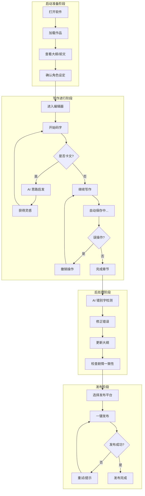

# 网文作者核心写作流程与痛点场景分析

**版本**: v1.0  
**日期**: 2026-05-06  
**基于文档**: PRD.md、user-research.md、system-design.md

---

## 1. 用户画像总结

### 1.1 三类核心用户

| 维度 | 全职作者 | 兼职作者 | 新手作者 |
|------|---------|---------|---------|
| **年龄** | 25-35 岁 | 22-30 岁 | 18-28 岁 |
| **身份** | 签约作者 | 上班族/学生 | 学生/刚入职 |
| **收入** | 5000-30000 元/月 | 0-5000 元/月 | 0-2000 元/月 |
| **日更字数** | 4000-10000 字 | 2000-4000 字 | 1000-3000 字 |
| **写作时段** | 集中（晚间为主） | 碎片化 | 不固定 |
| **技术熟练度** | 中等 | 中高 | 低-中 |
| **AI 接受度** | 观望 | 高 | 很高 |
| **核心诉求** | 数据安全 + 效率 | 多设备同步 + 快速启动 | 写作指导 + AI 辅助 |

### 1.2 核心需求优先级矩阵

```
          │ 高付费意愿
          │
    ┌─────┼─────────────────────────────┐
    │     │  AI 正文生成                │
    │     │  多平台发布                  │
    │     │                             │
高  │     │  AI 大纲生成                │
频  │     │  角色管理                    │
需  │     ├─────────────────────────────┤
求  │     │  实时自动保存  │ AI 错别字  │
    │     │  长文本撤销    │ 检测       │
    │     │  基本写作功能  │            │
    └─────┼─────────────────────────────┘
          │
          └───────────────────────────────
                    低频需求
```

---

## 2. 用户旅程地图

### 2.1 完整写作旅程（从打开软件到完成一章）



### 2.2 详细旅程分析

#### 阶段一：启动准备（5-10 分钟）

| 步骤 | 用户行为 | 触点 | 情绪 | 痛点 | 机会点 |
|------|----------|------|------|------|--------|
| 1. 打开软件 | 双击启动应用 | 桌面图标 | 期待、焦虑 | 启动慢、等待时间长 | 冷启动优化、快速进入 |
| 2. 加载作品 | 选择作品、章节 | 作品列表 | 专注 | 章节多时查找慢 | 智能搜索、最近编辑 |
| 3. 查看大纲/前文 | 回顾剧情、找衔接点 | 编辑器/大纲 | 回忆、思考 | 查找效率低、滚动长 | 大纲对照、智能定位 |
| 4. 确认角色设定 | 查看角色信息 | 角色面板 | 确认 | 角色信息分散、易忘 | 角色卡片、快速检索 |

**关键洞察**: 准备阶段时间越长，写作状态越容易被打断。需要**缩短准备时间**，让用户尽快进入写作状态。

#### 阶段二：写作进行（30-120 分钟）

| 步骤 | 用户行为 | 触点 | 情绪 | 痛点 | 机会点 |
|------|----------|------|------|------|--------|
| 5. 开始码字 | 连续输入文本 | 编辑器 | 沉浸、流畅 | 格式调整、字体设置 | 自动格式化、模板 |
| 6. 自动保存 | 系统自动保存 | 后台服务 | 安心 | - | 实时保存提示、状态可见 |
| 7. 卡文时刻 | 思考下一步剧情 | - | 焦虑、困惑 | 无思路、卡文时间长 | AI 思路启发、智能续写 |
| 8. 误操作 | 误删、误改 | 编辑器 | 恐慌、懊恼 | 撤销步数有限 | 长文本撤销、版本历史 |
| 9. 完成章节 | 章节结束、统计字数 | 字数统计 | 满足、成就感 | - | 目标达成提醒、进度激励 |

**关键洞察**: 写作阶段是最核心的体验，需要**极致流畅**。卡文和误操作是最大的中断点，需要智能辅助和强大的撤销能力。

#### 阶段三：后处理（5-15 分钟）

| 步骤 | 用户行为 | 触点 | 情绪 | 痛点 | 机会点 |
|------|----------|------|------|------|--------|
| 10. 错别字检测 | 检查错别字、语病 | AI 检测 | 审慎 | 错别字难自查、遗漏 | AI 智能检测、批量修正 |
| 11. 更新大纲 | 手动/自动更新大纲 | 大纲管理 | 疲惫 | 手动更新麻烦 | AI 自动生成/更新大纲 |
| 12. 剧情检查 | 检查前后矛盾 | - | 担忧 | 剧情混乱、角色冲突 | AI 一致性检查 |

**关键洞察**: 后处理是"不得不做但不想做"的环节，需要**自动化**减轻负担。

#### 阶段四：发布（2-5 分钟）

| 步骤 | 用户行为 | 触点 | 情绪 | 痛点 | 机会点 |
|------|----------|------|------|------|--------|
| 13. 选择平台 | 选择要发布的平台 | 发布面板 | 期待 | - | 记住上次选择 |
| 14. 一键发布 | 点击发布按钮 | 发布按钮 | 紧张 | 格式不统一、发布失败 | 自动格式化、重试机制 |
| 15. 发布完成 | 确认发布成功 | 状态提示 | 满足 | - | 发布成功提醒、历史记录 |

**关键洞察**: 多平台发布是全职作者的刚需，需要**一键完成**，避免重复操作。

---

## 3. 核心写作流程

### 3.1 场景一：日常码字（最高频）

**场景描述**: 作者每天定时写作，需要在舒适的环境中高效完成目标字数。

**流程**:
```
打开软件 → 查看今日目标 → 回顾前文（快速定位） → 进入专注模式 → 码字 → 自动保存 → 查看进度 → 完成目标
```

**关键触点**:
- 快速启动（≤ 3 秒）
- 今日目标显示（醒目位置）
- 自动保存提示（状态栏）
- 字数进度实时更新

**设计要点**:
1. **启动即写作**: 首页直接显示最近编辑的作品/章节
2. **目标可视化**: 今日目标、已完成、剩余字数一目了然
3. **专注模式**: 一键全屏，隐藏所有干扰元素
4. **保存可见**: 右上角显示"已保存"状态，让用户安心

**用户心声**:
> "我每天要写 4000 字，希望能快速进入状态，不要让我到处找功能。"  
> "写着写着突然发现没保存，吓死了。自动保存一定要可靠。"

---

### 3.2 场景二：卡文求助（中高频）

**场景描述**: 作者写到一半卡住了，不知道接下来怎么写，需要 AI 提供思路启发。

**流程**:
```
卡文 → 触发 AI 助手 → 输入当前上下文 → AI 分析前文 → 生成 3-5 个剧情走向建议 → 选择建议 → 继续写作
```

**关键触点**:
- AI 助手入口（侧边栏/快捷键）
- 上下文自动选取（前 5 章）
- 建议展示（卡片式/列表）
- 一键采纳

**设计要点**:
1. **低门槛触发**: 快捷键（如 Ctrl+I）快速唤起 AI 助手
2. **自动上下文**: 不需要用户手动输入，系统自动读取前文
3. **多方案选择**: 提供 3-5 个建议，用户选择最适合的
4. **快速采纳**: 点击建议即可插入编辑器，继续写作

**用户心声**:
> "卡文的时候最痛苦，有时候一卡就是半天。如果 AI 能给我几个方向，我就不会卡那么久。"  
> "不需要 AI 帮我写，只需要给我灵感，让我知道下一步怎么走。"

---

### 3.3 场景三：内容检查（中频）

**场景描述**: 章节写完后，需要检查错别字、语病，确保质量。

**流程**:
```
完成章节 → 触发 AI 检测 → 扫描全文 → 标注错误 → 分类展示（错字/别字/语病/标点） → 批量修正 → 确认完成
```

**关键触点**:
- AI 检测入口（工具栏/快捷键）
- 错误标注（高亮显示）
- 错误分类（标签式）
- 修正建议（侧边栏）
- 批量操作

**设计要点**:
1. **可视化标注**: 错误用不同颜色高亮，一眼识别
2. **分类过滤**: 错字、别字、语病、标点分别显示
3. **一键修正**: 点击建议即可修正，无需手动输入
4. **批量处理**: 支持全选、批量修正

**用户心声**:
> "我码字很快，错别字特别多。每次都要花很久检查，如果 AI 能帮我找出大部分，就省事多了。"  
> "有些错误我自己看不出来，AI 能帮我发现就太好了。"

---

### 3.4 场景四：多平台发布（中频）

**场景描述**: 作者需要将章节发布到多个平台（某点、某茄、晋江等）。

**流程**:
```
选择章节 → 点击发布 → 选择平台（多选） → 格式预览 → 确认发布 → 自动发布 → 查看状态 → 完成
```

**关键触点**:
- 发布入口（工具栏/右键菜单）
- 平台选择（复选框）
- 格式预览（发布前检查）
- 发布状态（成功/失败）
- 历史记录

**设计要点**:
1. **一键多平台**: 支持同时选择多个平台发布
2. **格式自适应**: 自动处理不同平台的格式要求
3. **状态可见**: 发布进度实时显示，失败提示明确
4. **重试机制**: 发布失败自动重试，并提供手动重试

**用户心声**:
> "我在三个平台签约，每天都要复制粘贴三次，太麻烦了。如果能一键发布，就太方便了。"  
> "有时候这个平台发成功了，那个失败了，我还得重新弄。希望能看到每个平台的状态。"

---

### 3.5 场景五：版本回溯（低频但关键）

**场景描述**: 作者误删了大段内容，或想回到之前的版本。

**流程**:
```
误操作 → Ctrl+Z 撤销 → 撤销不够 → 打开版本历史 → 选择历史版本 → 对比差异 → 恢复版本
```

**关键触点**:
- 撤销操作（Ctrl+Z）
- 版本历史入口（工具栏）
- 版本列表（时间线）
- 版本对比（Diff 可视化）
- 恢复操作

**设计要点**:
1. **长撤销栈**: 支持至少 50 步撤销，每步最多 2000 字
2. **版本快照**: 定期自动保存版本快照
3. **可视化对比**: 高亮显示版本差异，一目了然
4. **选择性恢复**: 支持恢复部分内容，而非全部覆盖

**用户心声**:
> "有一次我误删了一整章，撤销也找不回来，差点崩溃。所以撤销功能一定要强大。"  
> "有时候我会想对比一下之前写的版本，看看哪个更好。"

---

## 4. 痛点场景列表

### 4.1 P0 级痛点（必须解决）

| 编号 | 痛点 | 频率 | 影响程度 | 场景 | 解决方案 |
|------|------|------|----------|------|----------|
| P0-1 | 网页端丢稿 | 高 | 极高 | 写作中网络故障/浏览器崩溃 | 本地优先存储 + 实时自动保存 |
| P0-2 | 手动保存打断思路 | 高 | 高 | 写作中需要手动保存 | 自动保存（300ms 防抖） |
| P0-3 | 撤销步数有限 | 中 | 高 | 误删内容后无法找回 | 长文本撤销（≥50 步） |
| P0-4 | 多设备切换不便 | 高 | 高 | 兼职作者公司/家里切换 | 云端同步 + 离线写作 |
| P0-5 | 软件启动慢 | 高 | 中 | 每次打开软件等待 | 启动优化（≤3 秒） |

**P0 痛点特征**: 影响核心写作体验，直接决定用户是否愿意使用产品。

---

### 4.2 P1 级痛点（重要解决）

| 编号 | 痛点 | 频率 | 影响程度 | 场景 | 解决方案 |
|------|------|------|----------|------|----------|
| P1-1 | 错别字难自查 | 高 | 中 | 章节完成后检查 | AI 错别字检测 |
| P1-2 | 多平台发布繁琐 | 高 | 中 | 每日更新多平台 | 一键发布到多平台 |
| P1-3 | 卡文无思路 | 中 | 高 | 写作中途卡住 | AI 思路启发 |
| P1-4 | 不会写大纲 | 高 | 中 | 新手/长篇作品 | AI 大纲生成 |
| P1-5 | 剧情混乱/矛盾 | 中 | 中 | 长篇作品后期 | AI 一致性检查 |
| P1-6 | 角色设定矛盾 | 中 | 中 | 长篇作品角色多 | 角色管理系统 |
| P1-7 | 章节管理混乱 | 中 | 低 | 作品章节数量多 | 章节管理 + 拖拽排序 |

**P1 痛点特征**: 影响写作效率和质量，是差异化竞争的关键。

---

### 4.3 P2 级痛点（可选解决）

| 编号 | 痛点 | 频率 | 影响程度 | 场景 | 解决方案 |
|------|------|------|----------|------|----------|
| P2-1 | 封面设计难 | 低 | 低 | 作品发布时 | AI 封面生成 |
| P2-2 | 灵感易遗忘 | 中 | 低 | 碎片化灵感记录 | 灵感记录功能 |
| P2-3 | 缺乏写作统计 | 低 | 低 | 想了解写作习惯 | 写作数据分析 |
| P2-4 | 缺乏写作教程 | 低 | 低 | 新手不知道怎么写 | 写作指导功能 |

**P2 痛点特征**: 锦上添花，可提升用户满意度，但非核心需求。

---

### 4.4 痛点优先级排序逻辑

```
优先级 = 频率 × 影响程度 × 用户付费意愿

频率: 高=3, 中=2, 低=1
影响程度: 极高=4, 高=3, 中=2, 低=1
付费意愿: 高=3, 中=2, 低=1
```

**Top 5 痛点**:
1. **P0-1 网页端丢稿**: 3 × 4 × 1 = 12（必须免费解决）
2. **P0-2 手动保存打断思路**: 3 × 3 × 1 = 9
3. **P0-4 多设备切换不便**: 3 × 3 × 2 = 18
4. **P1-3 卡文无思路**: 2 × 3 × 3 = 18
5. **P1-1 错别字难自查**: 3 × 2 × 2 = 12

---

## 5. 对 UI/UX 设计的建议

### 5.1 核心设计原则

| 原则 | 描述 | 实现方式 |
|------|------|----------|
| **专注优先** | 一切为写作服务，避免干扰 | 简洁界面、专注模式、快捷键 |
| **数据可见** | 让用户随时知道数据状态 | 保存状态、字数统计、同步状态 |
| **智能辅助** | AI 隐形化，需要时出现 | 侧边栏 AI、快捷键触发 |
| **渐进增强** | 基础功能简单，高级功能隐藏 | 核心功能显性、AI 功能可折叠 |

---

### 5.2 界面布局建议

#### 主编辑器布局

```
┌─────────────────────────────────────────────────────────────┐
│  工具栏（精简，可隐藏）                                        │
│  [保存状态] [字数统计] [今日目标]          [主题] [设置]       │
├─────────────┬───────────────────────────────────┬───────────┤
│             │                                   │           │
│  侧边栏      │        编辑器（主区域）             │  AI 助手   │
│             │                                   │  （可折叠） │
│  [章节列表]  │                                   │           │
│  [大纲对照]  │     沉浸式写作区域                  │  [思路启发] │
│  [角色卡片]  │                                   │  [错别字]   │
│  [发布管理]  │                                   │  [续写]     │
│             │                                   │           │
│  （可折叠）  │                                   │           │
│             │                                   │           │
├─────────────┴───────────────────────────────────┴───────────┤
│  状态栏                                                       │
│  [作品名] [章节名] [光标位置] [网络状态] [同步状态]              │
└─────────────────────────────────────────────────────────────┘
```

**设计要点**:
1. **主区域最大化**: 编辑器占据 60-70% 空间
2. **侧边栏可折叠**: 写作时隐藏，需要时展开
3. **AI 助手不干扰**: 右侧独立区域，默认折叠
4. **状态栏常驻**: 底部始终显示关键状态

---

### 5.3 关键交互设计建议

#### 5.3.1 启动体验

**问题**: 用户希望快速进入写作状态，不想等待。

**建议**:
1. **冷启动优化**: 
   - 延迟加载非核心模块（AI、发布等）
   - 预编译关键资源
   - 显示加载进度（避免用户焦虑）

2. **快速进入**:
   - 首页显示最近编辑的作品/章节
   - 支持一键进入上次编辑位置
   - 提供"快速开始"按钮

3. **骨架屏**:
   - 启动时显示骨架屏，而非空白
   - 让用户感知到"正在加载"而非"卡死"

**验收标准**: 冷启动时间 ≤ 3 秒，用户可看到进度。

---

#### 5.3.2 自动保存体验

**问题**: 用户担心数据丢失，需要确认保存状态。

**建议**:
1. **实时保存提示**:
   - 右上角显示"已保存"状态（绿色勾）
   - 保存中显示"保存中..."（加载动画）
   - 保存失败显示"保存失败"（红色感叹号）

2. **自动保存频率**:
   - 300ms 防抖（避免频繁写入）
   - 每输入一个字符后触发
   - 切换章节时强制保存

3. **离线检测**:
   - 断网时提示"离线模式，数据已保存到本地"
   - 联网后自动同步，提示"同步完成"

**验收标准**: 用户随时知道数据状态，不会因为网络问题而恐慌。

---

#### 5.3.3 撤销体验

**问题**: 用户误操作后需要快速找回，撤销步数有限。

**建议**:
1. **快捷键支持**:
   - Ctrl+Z: 撤销
   - Ctrl+Y / Ctrl+Shift+Z: 重做
   - Ctrl+Shift+H: 打开版本历史

2. **撤销提示**:
   - 撤销时显示"撤销: [操作描述]"
   - 支持连续撤销，显示当前步数

3. **版本历史**:
   - 提供版本历史面板
   - 支持版本对比（Diff 可视化）
   - 支持恢复到任意历史版本

**验收标准**: 支持至少 50 步撤销，用户不会因为误操作而丢失内容。

---

#### 5.3.4 AI 助手体验

**问题**: AI 功能需要低门槛触发，不干扰正常写作。

**建议**:
1. **快捷键触发**:
   - Ctrl+I: 打开 AI 助手
   - Ctrl+Shift+S: 错别字检测
   - Ctrl+Shift+O: 大纲生成

2. **上下文自动选取**:
   - AI 助手自动读取前文（前 5 章）
   - 不需要用户手动输入

3. **多方案选择**:
   - 提供 3-5 个建议，用户选择
   - 支持卡片式/列表展示
   - 支持一键采纳

4. **智能提示**:
   - 检测到用户卡文（输入停滞）时，主动提示
   - 用户可选择开启/关闭

**验收标准**: AI 助手不干扰正常写作，需要时快速出现，建议有价值。

---

#### 5.3.5 发布体验

**问题**: 多平台发布繁琐，需要重复操作。

**建议**:
1. **平台选择器**:
   - 复选框式选择多个平台
   - 记住上次选择的平台

2. **格式预览**:
   - 发布前预览格式
   - 显示平台特定要求（字数限制等）

3. **发布状态**:
   - 实时显示每个平台的发布进度
   - 成功/失败状态明显
   - 失败时提供重试按钮

4. **发布历史**:
   - 记录发布历史
   - 支持查看已发布章节

**验收标准**: 发布操作 ≤ 2 次点击，状态可见，失败可重试。

---

### 5.4 情感化设计建议

#### 5.4.1 目标达成激励

**场景**: 用户完成今日写作目标。

**建议**:
1. **进度可视化**:
   - 环形进度条显示今日目标完成度
   - 颜色变化：未开始（灰色）→ 进行中（蓝色）→ 已完成（绿色）

2. **达成庆祝**:
   - 完成目标时显示祝贺动画（可选）
   - 显示统计数据："今日完成 4000 字，累计写作 30 天"

3. **连续激励**:
   - 显示连续写作天数
   - 里程碑奖励（如连续 7 天、30 天）

**验收标准**: 让用户感受到成就感，激励持续写作。

---

#### 5.4.2 错误恢复信心

**场景**: 用户误操作或软件异常。

**建议**:
1. **友好的错误提示**:
   - 避免技术术语，使用用户能理解的语言
   - 提供明确的解决方案

2. **数据恢复信心**:
   - 提示"您的数据已自动保存"
   - 提供版本历史，让用户可回溯

3. **一键求助**:
   - 提供客服入口
   - 支持反馈问题

**验收标准**: 用户不会因为错误而恐慌，知道如何恢复。

---

#### 5.4.3 状态可见性

**场景**: 用户需要确认数据安全。

**建议**:
1. **保存状态常驻**:
   - 右上角始终显示"已保存"状态
   - 保存失败时明显提示

2. **同步状态可见**:
   - 显示同步进度
   - 显示最后同步时间

3. **离线模式明确**:
   - 断网时明确提示"离线模式"
   - 让用户知道数据仍在本地保存

**验收标准**: 用户随时知道数据状态，安心写作。

---

### 5.5 可访问性设计建议

| 类型 | 建议 | 优先级 |
|------|------|--------|
| **键盘导航** | 所有功能支持键盘操作 | P0 |
| **屏幕阅读器** | 关键元素添加 ARIA 标签 | P1 |
| **高对比度** | 提供高对比度主题 | P1 |
| **字体调节** | 支持字体大小调节 | P1 |
| **颜色盲** | 不仅依赖颜色传达信息 | P2 |

---

### 5.6 性能体验建议

| 场景 | 性能要求 | 实现方式 |
|------|----------|----------|
| **启动** | ≤ 3 秒 | 懒加载、预编译、V8 快照 |
| **输入** | ≤ 50ms | CodeMirror 优化、虚拟滚动 |
| **保存** | ≤ 100ms | 防抖、异步写入、增量保存 |
| **撤销** | ≤ 200ms | 内存操作、压缩策略 |
| **AI 检测** | ≤ 3 秒/千字 | 流式返回、进度显示 |
| **AI 生成** | ≤ 30 秒/章 | 流式返回、可取消 |

---

## 6. 关键设计决策

### 6.1 为什么采用"侧边栏 + 主编辑器 + AI 助手"布局？

**理由**:
1. **主编辑器最大化**: 写作是核心任务，编辑器应占据最大空间
2. **侧边栏可折叠**: 不需要时隐藏，需要时展开，不干扰写作
3. **AI 助手独立**: AI 是辅助功能，不应占据主区域，但需要时易于访问
4. **状态栏常驻**: 数据安全是底线，状态信息必须始终可见

**备选方案**: 
- 单栏布局（过于简单，不支持大纲对照）
- 双栏布局（AI 助手占据过多空间）

**决策**: 采用三栏布局，默认折叠侧边栏和 AI 助手，最大化主编辑器。

---

### 6.2 为什么自动保存采用 300ms 防抖？

**理由**:
1. **避免频繁写入**: 每个字符都保存会导致 IO 过高，影响性能
2. **用户无感知**: 300ms 是用户可接受的延迟，几乎无感知
3. **数据安全**: 300ms 内的输入不会丢失，最多丢失 300ms 的内容
4. **技术可行**: SQLite 支持高频写入，300ms 防抖后写入频率可接受

**备选方案**:
- 无防抖（性能问题）
- 1 秒防抖（延迟过长，用户可能感知）
- 手动保存（违反"自动保存"原则）

**决策**: 采用 300ms 防抖，确保性能和数据安全。

---

### 6.3 为什么 AI 助手默认折叠？

**理由**:
1. **专注写作**: AI 是辅助功能，不应占据主区域，避免干扰
2. **降低认知负担**: 不需要 AI 时，不显示，减少用户分心
3. **需要时快速访问**: 快捷键（Ctrl+I）一键唤起，不影响效率
4. **渐进增强**: 新手可能不知道 AI 功能，折叠可避免困惑

**备选方案**:
- 默认展开（占据过多空间，干扰写作）
- 完全隐藏（用户可能不知道有此功能）

**决策**: AI 助手默认折叠，快捷键快速唤起。

---

## 7. 下一步行动

### 7.1 设计阶段任务

| 任务 | 输出文档 | 负责人 | 时间 |
|------|----------|--------|------|
| 界面原型设计 | docs/design/ui-prototype.md | @ui-designer | 1 周 |
| 交互流程图 | docs/design/interaction-flow.md | @ux-architect | 1 周 |
| 设计规范 | docs/design/design-system.md | @ui-designer | 1 周 |

### 7.2 开发阶段任务

| 任务 | 输出 | 负责人 | 时间 |
|------|------|--------|------|
| 编辑器核心开发 | src/core/editor | @frontend-developer | 2 周 |
| 自动保存开发 | src/core/storage | @frontend-developer | 1 周 |
| 撤销系统开发 | src/core/undo | @frontend-developer | 1 周 |

---

## 8. 附录

### 8.1 用户画像详细资料

详见 `docs/user-research.md`

### 8.2 技术架构详细设计

详见 `docs/architecture/system-design.md`

### 8.3 产品需求详细说明

详见 `docs/PRD.md`

---

**文档状态**: 初稿完成  
**下一步**: UI 原型设计  
**负责人**: @ux-researcher, @ux-architect, @ui-designer
