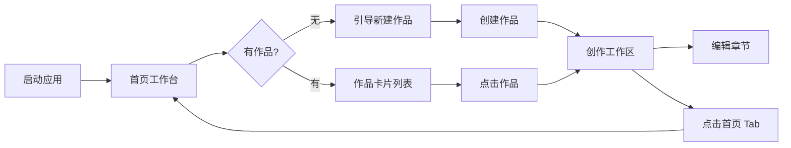
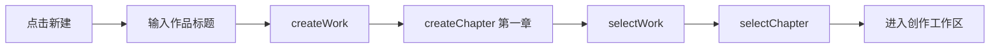

# 作家助手式 UI/功能重设计方案

**版本**: v1.0  
**日期**: 2026-05-07  
**状态**: 设计落地稿  
**适用范围**: Tauri + React 桌面客户端前端重构  
**参考对象**: 用户提供的“作家助手”首页与书籍创作页截图  

---

## 1. 设计目标

当前客户端已完成 P0 验证：本地写作、自动保存、登录注册、云端 API 连通、Tauri CLI 自检均可用。下一阶段目标不是新增大量后端功能，而是把现有能力包装成更接近成熟网文写作工具的桌面体验。

### 1.1 核心目标

| 目标 | 说明 | 落地方式 |
|------|------|----------|
| 熟悉感 | 让网文作者打开后能立刻理解“作品管理”和“章节创作”两个核心场景 | 采用“首页工作台 + 创作工作区”双场景 |
| 专注写作 | 创作页减少作品管理干扰，突出章节树、编辑器和写作工具 | 左章节栏 + 中央编辑区 + 右工具竖栏 |
| 渐进增强 | P1/P2 功能先作为入口存在，不阻塞 P0 写作闭环 | 未实现功能使用灰态、门禁或提示 |
| 状态可信 | 不再把网络异常简单展示成“离线本地模式”，区分本地保存、云端同步、同步失败 | 状态文案与数据来源拆分 |
| 可快速实现 | 首版优先 UI 重排和现有 store 复用，避免大规模 API/数据模型变更 | 只改前端布局和组件 |

### 1.2 非目标

本次重设计不直接实现以下完整业务能力：

- 真实投稿到阅文或其他平台。
- 墨水商店、装扮中心、邀请奖励等商业化系统。
- 完整任务体系和奖励结算。
- 真实短剧剧本业务流。
- 高级 AI 工具的完整后端闭环。

这些能力在 UI 中可以出现为入口，但必须明确为“即将开放”“登录后使用”“开发中”或灰态，避免误导用户。

---

## 2. 产品信息架构

新客户端采用两级信息架构。

```text
应用
├── 首页工作台 WriterHome
│   ├── 左侧全局导航
│   ├── 用户信息区
│   ├── 顶部运营/任务卡片区
│   ├── 快捷操作区
│   ├── 作品列表区
│   └── 底部辅助入口
│
└── 创作工作区 WriterWorkspace
    ├── 顶部标签栏
    ├── 顶部编辑工具栏
    ├── 左侧章节栏
    ├── 中央编辑器
    ├── 右侧工具竖栏
    └── 底部状态栏
```

### 2.1 页面切换关系



### 2.2 当前数据映射

| 设计对象 | 当前数据/函数 | 说明 |
|----------|---------------|------|
| 用户头像/昵称 | `useAuthStore().user` | 未登录显示默认头像和“本地作者” |
| 登录状态 | `isAuthenticated` | 决定云同步、发布、AI 入口状态 |
| 作品卡片 | `works` | 首页列表展示 |
| 当前作品 | `currentWork` | 创作页标题、tab、章节栏标题 |
| 章节树 | `chapters` | 左侧章节列表 |
| 当前章节 | `currentChapter` | 编辑器标题与正文 |
| 新建作品 | `createWork` | 首页快捷入口和空状态 |
| 新建章节 | `createChapter` | 创作页左栏按钮 |
| 保存 | `saveCurrentChapter` | 自动保存与手动保存 |
| 本地存储 | `useLocalWorkStore().getStorageSize()` | 未登录/本地模式提示 |
| 云端健康 | `api.healthCheck()` | 顶部状态显示 |
| 同步状态 | `syncStatus`, `syncError` | 登录后同步反馈 |

---

## 3. 首页工作台设计

首页工作台对应参考图“软件打开主页面”。定位是作品管理、账号状态、快捷入口与运营入口集合。

### 3.1 布局结构

```text
┌────────────────────────────────────────────────────────────────────────────┐
│ 顶部窗口/标签栏：作家助手 | 当前打开作品 Tab | 同步状态 | 刷新 | 设置 | 窗口按钮 │
├──────────────┬─────────────────────────────────────────────────────────────┤
│              │                                                             │
│ 全局导航栏     │  主内容区                                                     │
│ 180px         │                                                             │
│              │  ┌───────────────┐ ┌─────────────────────────────────────┐  │
│ 头像/昵称      │  │ 反馈横幅       │ │ 任务/每日目标/邀请卡                 │  │
│ 小说作品       │  └───────────────┘ └─────────────────────────────────────┘  │
│ 短剧剧本       │                                                             │
│ 码字统计       │  ┌──────┐ ┌──────┐ ┌──────┐ ┌──────┐                       │
│ 码字好友       │  │ 新建 │ │ 导入 │ │ 投稿 │ │ 模板 │                       │
│ 阅创学堂       │  └──────┘ └──────┘ └──────┘ └──────┘                       │
│ 神助社区       │                                                             │
│ 任务中心       │  全部作品 ▼                         已隐藏 | 回收站          │
│ 墨水商店       │                                                             │
│ 邀请卡         │  ┌──────────┐ ┌──────────┐ ┌──────────┐                    │
│ 装扮中心       │  │ 作品卡片   │ │ 作品卡片   │ │ 作品卡片   │                    │
│ 消息通知       │  └──────────┘ └──────────┘ └──────────┘                    │
│              │                                                             │
│ 底部工具       │                                                             │
└──────────────┴─────────────────────────────────────────────────────────────┘
```

### 3.2 左侧全局导航

#### 导航项

| 名称 | 首版状态 | 行为 |
|------|----------|------|
| 小说作品 | 可用 | 展示当前作品列表 |
| 短剧剧本 | 占位 | 提示“短剧剧本功能开发中” |
| 码字统计 | 占位 | 提示“统计功能开发中” |
| 码字好友 | 占位 | 提示“社交功能开发中” |
| 阅创学堂 | 占位 | 提示“学习中心开发中” |
| 神助社区 | 占位 | 提示“社区功能开发中” |
| 任务中心 | 占位 | 提示“任务功能开发中” |
| 墨水商店 | 占位 | 提示“商城功能开发中” |
| 邀请卡 | 占位 | 提示“邀请功能开发中” |
| 装扮中心 | 占位 | 提示“装扮功能开发中” |
| 消息通知 | 占位 | 显示静态红点或开发中 |

#### 设计要求

- 宽度固定 180px。
- 背景 `#f3f5f8`，选中项使用浅蓝底 `#dbeafe`。
- 图标使用 lucide-react 或文本符号，不引入复杂图标系统。
- 用户区域显示头像、昵称和登录状态。
- 未登录时显示“本地作者”，点击头像或昵称打开登录弹窗。

### 3.3 顶部运营/状态区

该区域保留参考图的卡片感，但首版要避免重运营。

#### 左侧反馈横幅

| 字段 | 内容 |
|------|------|
| 标题 | 作家意见收集渠道 |
| 副标题 | fankui@example.com 或“欢迎反馈使用体验” |
| 风格 | 蓝色渐变背景，右侧文档/钢笔插画可用 CSS 图形或简化图标 |

#### 中间任务卡

| 字段 | 内容 |
|------|------|
| 标题 | 做任务赚墨水 |
| 进度 | `1/22` 静态或后续接任务系统 |
| 主任务 | 每日码字超过 1000 字得 5 墨水 |
| 进度文案 | 今日已写 X 字，还差 Y 字 |
| 按钮 | 去完成，点击进入当前作品或创建作品 |

#### 右侧邀请卡

| 字段 | 内容 |
|------|------|
| 标题 | 邀请用户奖励多多 |
| 副文案 | 得 300 墨水等 |
| 按钮 | 分享口令 |
| 首版行为 | 弹出“邀请功能开发中” |

### 3.4 快捷操作区

| 操作 | 首版行为 | 说明 |
|------|----------|------|
| 新建 | 打开新建作品弹窗 | 接现有 `createWork` |
| 导入 | 弹出开发中 | 后续接本地文件导入 |
| 投稿阅文 | 需要登录，未实现 | 走 `FeatureGate`，提示 P1 |
| 模板中心 | 弹出开发中 | 后续接模板选择 |

卡片样式：

- 高度 60px。
- 圆角 8px。
- 白底细边框。
- 左侧彩色图标块，右侧标题和副标题。

### 3.5 作品列表区

#### 作品卡片结构

```text
┌──────────────┐
│ 私密/云端标签 │
│              │
│   蓝色封面     │
│   羽毛/笔图标  │
│              │
├──────────────┤
│ 作品标题       │
│ X 章 · Y 字    │
│ 同步状态/更多  │
└──────────────┘
```

#### 空状态

无作品时显示：

- 主文案：“还没有作品，先创建一本开始写吧”
- 次文案：“支持本地创作，登录后自动同步到云端”
- 主按钮：“新建作品”

#### 筛选入口

首版只做 UI：

- 全部作品 ▼
- 已隐藏
- 回收站

点击后可提示开发中，不影响写作闭环。

---

## 4. 创作工作区设计

创作工作区对应参考图“书籍创作页面”。定位是持续码字、章节管理和辅助工具。

### 4.1 布局结构

```text
┌──────────────────────────────────────────────────────────────────────────────┐
│ 标签栏：作家助手 | 《当前作品》 x                         同步状态 | 窗口按钮 │
├──────────────────────────────────────────────────────────────────────────────┤
│ 工具栏：字体 背景 撤销 重做 一键排版 插入 输入 | 全屏 闪关 查找 取名 画师 历史 发布 │
├────────────────┬───────────────────────────────────────────────┬─────────────┤
│ 左侧章节栏       │ 中央编辑区                                      │ 右侧工具竖栏  │
│ 258px          │                                               │ 48px        │
│ 搜索            │       第1章                                    │ 校对         │
│ 新建章 新建卷     │                                               │ 拼字         │
│ 草稿 筛选         │       正文编辑器                                │ 大纲         │
│ 作品相关 0章      │                                               │ 角色         │
│ 第一卷 1章        │                                               │ 设定         │
│ 第1章            │                                               │ 灵感         │
│                │                                               │ 双栏         │
├────────────────┴───────────────────────────────────────────────┴─────────────┤
│ 底部状态栏：+ 新建章节 | 计划：剩 4553 | 纠错 | 本章：0 | 光标位置              │
└──────────────────────────────────────────────────────────────────────────────┘
```

### 4.2 顶部标签栏

| 元素 | 行为 |
|------|------|
| 作家助手 Tab | 点击返回首页 |
| 当前作品 Tab | 当前工作区激活态 |
| 关闭 x | 返回首页，不关闭应用 |
| 同步状态 | 显示本地实时保存中、云端已同步、同步失败 |
| 刷新图标 | 调用 `checkApi()` 和 `loadWorks()` |
| 设置图标 | 打开设置菜单，包含退出登录等功能（见下方设置菜单设计） |

#### 设置菜单设计

设置菜单采用弹窗形式，点击设置图标后打开。

**首版设置菜单项**：

| 菜单项 | 行为 | 状态 |
|--------|------|------|
| 退出登录 | 仅在已登录时显示，点击后退出登录并返回首页 | 可用 |

**交互规则**：

- 未登录时：设置菜单显示空或仅显示"暂无设置项"
- 已登录时：设置菜单显示"退出登录"选项
- 点击"退出登录"后：
  1. 调用 `logout()` 清除登录状态
  2. 返回首页
  3. 重新加载作品列表（本地作品）

**设计原因**：

退出登录不应该作为首页顶部的固定按钮出现，这会：
1. 占用屏幕空间
2. 不符合常见应用的交互模式
3. 容易被误点

将退出登录放在设置菜单里，符合用户习惯，且不会干扰主界面。

### 4.3 编辑工具栏

工具栏采用“可见但不打断”的轻量按钮。

| 工具 | 首版状态 | 行为 |
|------|----------|------|
| 字体 | 占位 | 后续切换字体 |
| 背景 | 可接主题 | 后续打开主题切换 |
| 撤销 | 可用 | CodeMirror 原生 Ctrl+Z；按钮后续接命令 |
| 重做 | 可用 | CodeMirror 原生 Ctrl+Y/Ctrl+Shift+Z；按钮后续接命令 |
| 一键排版 | 占位 | 后续实现段落格式化 |
| 插入 | 占位 | 后续插入分隔符/标记 |
| 输入 | 占位 | 后续语音/输入设置 |
| 全屏 | 占位 | 后续 Tauri 窗口全屏 |
| 闪关 | 占位 | 后续专注冲刺模式 |
| 查找替换 | 占位 | 后续接 CodeMirror search |
| 取名 | 需登录 | AI/素材功能入口 |
| 画师 | 需登录 | AI 封面/素材入口 |
| 历史 | 占位 | 后续版本历史 |
| 发布到阅文 | 需登录 | P1 多平台发布入口 |
| 发布到其他平台 | 需登录 | P1 多平台发布入口 |

首版按钮不应全部实现真实功能，必须使用统一提示：

```text
“该功能将在后续版本开放”
```

对登录门禁功能使用：

```text
“登录后可使用 {功能名}”
```

### 4.4 左侧章节栏

#### 结构

```text
搜索框：全书

[新建章] [新建卷]

草稿  筛选 v                         删除/导入/排序图标

作品相关                              0章
第一卷                                N章
  第1章
  第2章
```

#### 首版数据策略

当前数据模型没有“卷”。首版使用虚拟卷：

- 所有章节归入“第一卷”。
- `作品相关` 固定显示 `0章`。
- “新建卷”提示开发中。
- 章节排序按 `chapter.order`。

#### 交互

| 操作 | 行为 |
|------|------|
| 搜索章节 | 首版可只过滤本地 `chapters` 标题 |
| 新建章 | 调用现有 `createChapter` |
| 新建卷 | 提示开发中 |
| 点击章节 | 调用 `selectChapter` |
| 章节选中态 | 浅蓝底、加粗 |
| 无章节 | 显示“新建第一章”按钮 |

### 4.5 中央编辑区

#### 视觉要求

- 背景为浅灰 `#f5f7fb`。
- 编辑纸张区域可直接铺满，不强制卡片阴影。
- 章节标题位于编辑区顶部，字号 24px，字重 500。
- 正文使用网文标准：18px 宋体/衬线字体，行高 2.0，段首缩进 2 字符。
- 保留 CodeMirror，不替换编辑器内核。

#### 编辑器行为

| 行为 | 要求 |
|------|------|
| 输入 | 继续触发当前 `onChange` |
| 自动保存 | 保留现有 300ms 防抖机制 |
| Ctrl+S | 手动保存 |
| 章节切换 | 更新 `content` 为章节内容 |
| 空章节 | 显示标题，编辑区为空 |

### 4.6 右侧工具竖栏

右侧工具栏模仿参考图的窄栏结构。

| 工具 | 功能归类 | 首版行为 |
|------|----------|----------|
| 校对 | 错别字检测 | 需登录，提示 P1 |
| 拼字 | 写作目标/冲刺 | 提示开发中 |
| 大纲 | AI 大纲 | 需登录，提示 P1 |
| 角色 | 角色卡 | 提示开发中 |
| 设定 | 世界观/设定 | 提示开发中 |
| 灵感 | AI 灵感 | 需登录，提示 P1 |
| 双栏 | 分屏写作 | 提示开发中 |
| 妙笔 | AI 续写/润色 | 需登录，提示 P1 |

设计要求：

- 宽度 48px。
- 图标在上、文字在下。
- 可显示红点表示新功能。
- hover 时显示浅灰背景。
- 点击未实现功能时弹出轻提示或 Modal。

### 4.7 底部状态栏

| 区域 | 内容 |
|------|------|
| 左侧 | `+ 新建章节` |
| 中间 | `计划：剩 4,553`，首版使用静态目标 5000 - 本章字数 |
| 右侧 | `纠错`、`本章：{wordCount}`、光标位置 |

状态栏高度 24px，背景 `#f8fafc`，边框 `#e5e7eb`。

---

## 5. 状态与文案规范

### 5.1 保存/同步状态拆分

旧文案“离线本地模式”容易让用户以为登录失败或网络错误。新设计将保存状态拆成两类。

#### 本地保存状态

| 状态 | 文案 |
|------|------|
| 保存中 | 本地实时保存中 |
| 已保存 | 本地已保存 |
| 未保存 | 有未保存内容 |
| 保存失败 | 本地保存失败 |

#### 云端同步状态

| 条件 | 文案 |
|------|------|
| 已登录且 health ok 且 sync success | 云端已同步 |
| 已登录且正在同步 | 云端同步中 |
| 已登录但 sync error | 云端同步失败 |
| 已登录但 health error | 云端暂不可用，本地已保存 |
| 未登录 | 本地创作，登录后同步 |

### 5.2 登录状态文案

| 状态 | 首页文案 | 创作页文案 |
|------|----------|------------|
| 未登录 | 本地作者 | 本地创作，登录后同步 |
| 已登录 | 用户昵称 | 云端已同步/同步中/同步失败 |
| 注册后首次登录 | 用户昵称 + “已登录” | 自动同步本地作品 |

### 5.3 未实现功能提示

统一文案：

```text
该功能将在后续版本开放
```

登录门禁文案：

```text
登录后可使用 {功能名}
```

开发中但属 P1 的功能文案：

```text
{功能名} 属于 P1 能力，当前版本先保留入口
```

---

## 6. 组件拆分设计

为避免 `Main.tsx` 继续膨胀，落地时应拆分组件。

### 6.1 推荐目录

```text
src/frontend/src/components/
├── shell/
│   ├── AppTabs.tsx
│   └── SyncIndicator.tsx
│
├── home/
│   ├── WriterHome.tsx
│   ├── GlobalSidebar.tsx
│   ├── HeroBanner.tsx
│   ├── TaskCard.tsx
│   ├── QuickActionCard.tsx
│   └── WorkCard.tsx
│
├── workspace/
│   ├── WriterWorkspace.tsx
│   ├── EditorToolbar.tsx
│   ├── ChapterSidebar.tsx
│   ├── RightToolRail.tsx
│   └── WorkspaceStatusBar.tsx
│
└── common/
    ├── ComingSoon.tsx
    └── ConfirmModal.tsx
```

### 6.2 组件职责

| 组件 | 职责 | 数据来源 |
|------|------|----------|
| `Main` | 状态编排、弹窗控制、home/editor 切换 | stores |
| `WriterHome` | 首页布局 | works, user, apiStatus |
| `GlobalSidebar` | 全局导航 | user, isAuthenticated |
| `WorkCard` | 作品卡片 | work |
| `WriterWorkspace` | 创作页布局 | currentWork, currentChapter |
| `EditorToolbar` | 顶部工具栏 | saved, auth state |
| `ChapterSidebar` | 章节树和新建章节 | chapters, currentChapter |
| `RightToolRail` | AI/辅助工具入口 | isAuthenticated |
| `WorkspaceStatusBar` | 底部字数/计划/保存状态 | content, currentChapter |
| `SyncIndicator` | 同步状态展示 | apiStatus, syncStatus |

### 6.3 Props 草案

```ts
type ViewMode = 'home' | 'workspace';

interface WriterHomeProps {
  works: Work[];
  user: User | null;
  isAuthenticated: boolean;
  apiStatus: 'checking' | 'ok' | 'error';
  onOpenWork: (workId: string) => void;
  onCreateWork: () => void;
  onLogin: () => void;
  onComingSoon: (feature: string) => void;
}

interface WriterWorkspaceProps {
  works: Work[];
  currentWork: Work | null;
  chapters: Chapter[];
  currentChapter: Chapter | null;
  content: string;
  saved: boolean;
  isAuthenticated: boolean;
  onBackHome: () => void;
  onSelectChapter: (chapterId: string) => void;
  onCreateChapter: () => void;
  onContentChange: (content: string) => void;
  onSave: () => void;
  onLogin: () => void;
  onComingSoon: (feature: string) => void;
}
```

---

## 7. 视觉规范

### 7.1 基础色彩

| 用途 | 色值 | 说明 |
|------|------|------|
| 应用背景 | `#f5f7fb` | 类桌面软件浅灰 |
| 侧栏背景 | `#f2f4f7` | 左侧全局导航 |
| 卡片背景 | `#ffffff` | 首页卡片/按钮 |
| 边框 | `#e5e7eb` | 细分割线 |
| 主蓝 | `#2f7df6` | 主要按钮和选中态 |
| 浅蓝选中 | `#dbeafe` | 导航/章节选中 |
| 文本主色 | `#111827` | 标题正文 |
| 文本次色 | `#6b7280` | 辅助说明 |
| 危险/红点 | `#ef4444` | 红点提示 |
| 成功 | `#10b981` | 同步成功 |

### 7.2 尺寸

| 元素 | 尺寸 |
|------|------|
| 顶部标签栏 | 40px |
| 首页左侧导航 | 180px |
| 首页主内容最大宽 | 不限制，左右 padding 40px |
| 快捷卡片高度 | 60px |
| 作品封面 | 122px x 160px |
| 创作页左章节栏 | 258px |
| 创作页右工具栏 | 48px |
| 编辑工具栏 | 48px |
| 底部状态栏 | 24px |

### 7.3 字体

| 场景 | 字体 | 字号 |
|------|------|------|
| UI 常规 | Microsoft YaHei / PingFang SC / Segoe UI | 13-14px |
| 首页标题 | Microsoft YaHei / PingFang SC | 20-28px |
| 章节标题 | Microsoft YaHei / PingFang SC | 24px |
| 正文编辑 | Songti SC / SimSun / Noto Serif SC | 18px |
| 状态栏 | Microsoft YaHei / Segoe UI | 12px |

---

## 8. 交互细节

### 8.1 打开作品

```mermaid
graph LR
    A[首页点击作品卡片] --> B[selectWork(work.id)]
    B --> C[加载章节]
    C --> D{有章节?}
    D -->|有| E[选择最近/第一章]
    D -->|无| F[提示新建章节]
    E --> G[切换到创作工作区]
    F --> G
```

首版若没有最近章节记录，则默认选择第一章。

### 8.2 新建作品



### 8.3 保存反馈

- 用户输入后状态变成“本地实时保存中”。
- 防抖保存完成后显示“本地已保存”。
- 已登录时后台同步成功显示“云端已同步”。
- 同步失败时不阻断编辑，显示“云端同步失败，本地已保存”。

---

## 9. MVP 落地范围

### 9.1 第一版必须实现

- 首页工作台布局。
- 全局左侧导航 UI。
- 作品卡片网格。
- 新建作品并进入创作页。
- 点击作品进入创作页。
- 创作页标签栏和顶部工具栏 UI。
- 左侧章节栏。
- 中央 CodeMirror 编辑器。
- 右侧工具竖栏 UI。
- 底部状态栏。
- 登录/注册入口保留。
- 本地保存、手动保存、章节切换继续可用。
- 云端状态文案改为明确的保存/同步状态。

### 9.2 第一版可以只做占位

- 导入。
- 投稿阅文。
- 模板中心。
- 任务中心。
- 墨水商店。
- 邀请卡。
- 短剧剧本。
- 查找替换按钮。
- 取名/画师/妙笔。
- 右侧校对/大纲/角色/设定等工具的实际面板。

### 9.3 第一版不做

- 拖拽排序章节。
- 多卷管理数据模型。
- 真实版本历史。
- 真实平台发布。
- 真实任务奖励系统。
- 复杂动效。

---

## 10. 实施计划

### 阶段 1：首页和页面模式

| 任务 | 文件 |
|------|------|
| 增加 `viewMode` 状态 | `Main.tsx` |
| 增加全局常驻标签栏 | `components/shell/AppTabs.tsx` |
| 拆出 `WriterHome` | `components/home/WriterHome.tsx` |
| 拆出 `GlobalSidebar` | `components/home/GlobalSidebar.tsx` |
| 拆出 `WorkCard` | `components/home/WorkCard.tsx` |
| 首页新建作品流程接现有弹窗 | `Main.tsx` |

验收：启动进入首页，点击作品进入创作页。

### 阶段 2：创作页布局

| 任务 | 文件 |
|------|------|
| 拆出 `WriterWorkspace` | `components/workspace/WriterWorkspace.tsx` |
| 拆出 `ChapterSidebar` | `components/workspace/ChapterSidebar.tsx` |
| 拆出 `EditorToolbar` | `components/workspace/EditorToolbar.tsx` |
| 拆出 `RightToolRail` | `components/workspace/RightToolRail.tsx` |
| 拆出 `WorkspaceStatusBar` | `components/workspace/WorkspaceStatusBar.tsx` |

验收：章节选择、编辑、保存可用。

### 阶段 3：状态与占位能力

| 任务 | 文件 |
|------|------|
| 统一保存/同步文案 | `SyncIndicator.tsx` |
| 增加开发中提示 | `ComingSoon.tsx` 或 Main 内状态 |
| P1 功能入口接 `FeatureGate` | workspace/home components |

验收：未实现功能不会静默失败；登录门禁明确。

### 阶段 4：构建与回归

| 验收项 | 命令/方式 |
|--------|-----------|
| TypeScript 构建 | `npm run build` |
| Tauri 构建 | `npm run tauri build` |
| CLI 自检 | `app.exe --test --json` |
| 手工验证 | 首页、新建、进入创作页、编辑、保存、登录 |

---

## 11. 风险与约束

| 风险 | 影响 | 规避 |
|------|------|------|
| 首页功能入口太多导致误导 | 用户以为全部可用 | 未实现入口统一显示开发中 |
| `Main.tsx` 继续膨胀 | 后续维护困难 | 第一版就拆组件 |
| 登录/同步状态再次混淆 | 用户误判网络状态 | 拆分本地保存和云端同步文案 |
| 一次重构过大破坏 P0 | 已验证功能回归 | 不动 stores/API，只改 UI 组合 |
| CodeMirror 工具按钮难直接控制 | 撤销/查找按钮不能立即接入 | 首版保留快捷键能力，按钮先占位 |

---

## 12. 设计验收清单

### 首页

- [ ] 启动后默认显示首页工作台。
- [ ] 左侧导航与参考图结构一致。
- [ ] 用户头像/昵称显示正确。
- [ ] 登录/未登录状态可辨识。
- [ ] 新建作品入口可用。
- [ ] 作品卡片可点击进入创作页。
- [ ] 无作品时有清晰空状态。

### 创作页

- [ ] 顶部 tab 可返回首页。
- [ ] 工具栏视觉接近参考图。
- [ ] 左侧章节栏可新建/选择章节。
- [ ] 中央编辑器可输入。
- [ ] 保存状态可见。
- [ ] 右侧工具栏入口完整。
- [ ] 底部状态栏显示本章字数。

### 功能回归

- [ ] 注册可用。
- [ ] 登录可用。
- [ ] 本地写作可用。
- [ ] 登录后云端保存/加载不回退。
- [ ] CLI 测试通过。
- [ ] Tauri 安装包可构建。

---

## 13. 结论

本方案将当前客户端从“基础三栏编辑器”升级为“作家助手式双场景桌面软件”：首页负责作品管理和功能入口，创作页负责专注码字和章节组织。第一版应坚持小步落地，复用现有 store 和 API，不改变后端协议，优先保证已经通过验证的 P0 能力稳定。

推荐下一步直接进入阶段 1：首页和页面模式实现。
